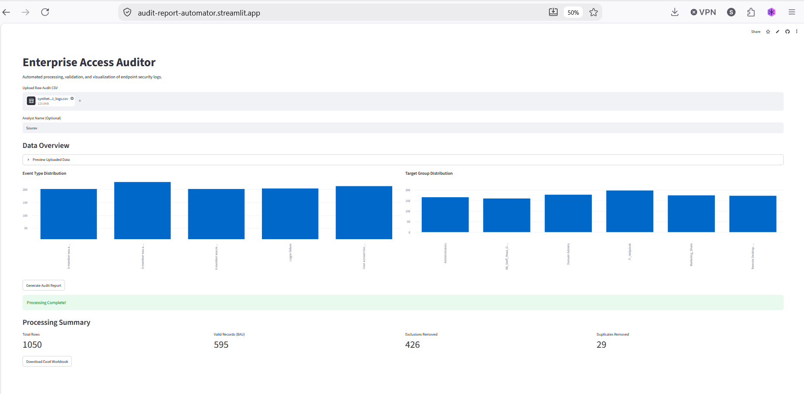

# 🛡️ Enterprise Access Auditor

[](https://www.python.org/)
[](https://streamlit.io/)
[](https://pandas.pydata.org/)
[](#)

**Live Demo:** [Launch the Interactive Dashboard](https://audit-report-automator.streamlit.app/)

### Dashboard Preview


## 📌 Project Overview

## 💡 Business Impact & ROI: Return on Investment
This automation was engineered to resolve a critical operational bottleneck. Previously, processing these complex security datasets required **90 minutes of daily manual effort** per team member and involved over **30 repetitive steps** in Excel, making the process highly susceptible to human error. 

By replacing this manual workflow with a vectorized Python pipeline, the reporting process was reduced to seconds. This completely eliminates data manipulation errors, ensures strict compliance consistency, and recovers hundreds of hours of valuable engineering time annually.

The **Enterprise Access Auditor** is an automated data processing and visualization pipeline designed to replace manual, error-prone spreadsheet tasks in enterprise compliance. It ingests raw server access logs, applies complex business exclusion rules using vectorized operations, visualizes the data distribution, and generates a structured, multi-tab audit workbook.

This project demonstrates scalable **Data Automation** and **Interactive Visualization**, highlighting how raw operational data can be rapidly transformed into actionable compliance intelligence.

## 🏗️ Architecture & Tech Stack
This tool is built entirely in Python, leveraging industry-standard data engineering and front-end frameworks:
* **Pandas:** Powers the core data engine. Utilizes vectorized string parsing and boolean masking to process thousands of records efficiently without expensive `for` loops.
* **Streamlit:** Drives the interactive web UI, providing instant data visualization (bar charts and metric cards) and dynamic file handling.
* **OpenPyXL:** Handles the programmatic generation of multi-sheet Excel reports, segregating data into Business As Usual (BAU), Exclusions, and Duplicates.
* **Faker:** Used to generate synthetic, anonymized enterprise datasets for safe local testing and demonstration.

## ✨ Key Features
1. **Vectorized Data Pipeline:** Instantly parses complex strings (e.g., `DOMAIN\User`) and filters records based on target activities and specific security groups.
2. **Automated Data Triage:** Intelligently routes data into distinct categories:
   * **Valid Records (BAU):** Clean data ready for compliance tracking.
   * **Exclusions:** Automatically flags service accounts (e.g., `svc-*`) and domain administrators.
   * **Duplicates:** Detects and separates redundant log entries.
3. **Interactive Visualizations:** Renders pre-download metric summaries and bar charts natively in the browser, allowing analysts to verify data integrity at a glance.
4. **Synthetic Data Generator:** Includes a standalone module to spin up realistic, randomized CSV test logs containing intentional noise and edge cases.
5. **Zero-Data Exfiltration (Local Execution):** Designed to comply with strict enterprise security policies. The entire Streamlit application and Pandas processing engine can run 100% locally  without an internet connection, ensuring confidential corporate audit logs never leave the internal network.

## 🚀 How to Run Locally

**1. Clone the repository**
```bash
git clone [https://github.com/YourUsername/access-audit-processor.git](https://github.com/YourUsername/access-audit-processor.git)
cd access-audit-processor

2. Create a virtual environment and install dependencies

python -m venv venv
source venv/bin/activate  # On Windows use: venv\Scripts\activate
pip install -r requirements.txt

3. Generate synthetic test data

python generate_fake_data.py
(This will generate a mock_audit_report.csv file in your root directory).

4. Launch the application

streamlit run app.py

📂 Repository Structure

├── app.py                  # Streamlit UI, visual routing, and file handling
├── process_report.py       # Core Pandas data transformation logic
├── generate_fake_data.py   # Faker script to generate synthetic CSV logs
├── requirements.txt        # Deployment dependencies
└── README.md               # Project documentation


👨‍💻 Author

Sourav Dutta

    LinkedIn: www.linkedin.com/in/sourav-dutta-15314b430

    Focus: Data Automation | Python Engineering | Data Visualization


